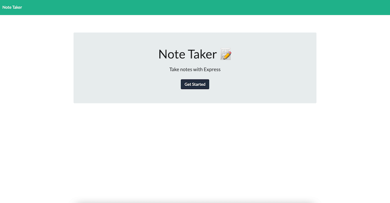
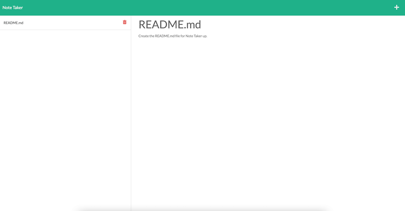
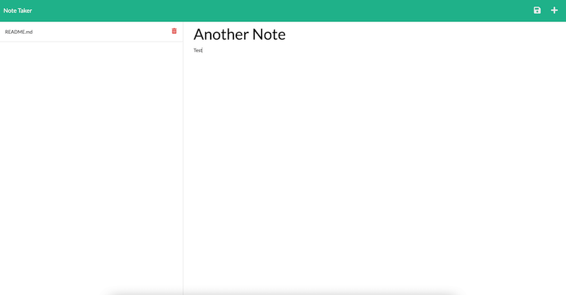

  <h1 align="center"> Note Taker  </h1>

## Description

  
You can see the project repository: <b>[here](https://github.com/mihaelavalac/note-taker)</b> 
   You can navigate to the deployed site <b>[here](https://note-taker-mv.herokuapp.com/)</b>

  
<i>The purpose of this application is to allow users to write and save notes so that they can organize their thoughts and keep track of tasks. While working on this project I empowered my fresh gathered knowledge of Express.js and  Node.js.</i>

## Table of Contents

- [Installation](#installation)
- [Features](#features)
- [Contributing](#contributing)
- [License](#license)
- [Questions](#questions)

## Installation

Follow the following instructions to install this project:   1. Download Nodejs to your computer.   2. Clone the project repo to your computer `git clone git@github.com:mihaelavalac/note-taker.git`   3. Navigate to the root of the project through your text editor.   4. Open terminal and run the following command `npm init` then, `npm install express` , `npm install fs`, `npm install path`   5. Run the `npm start` to start the Express server   6. Navigate to the `http://localhost:3001/`.   7. You should see the home page like bellow.      8. Click the `Get Started` button to be redirected to the notes page where you can add/deleted notes      

## Features
GIVEN a note-taking application
WHEN I open the Note Taker
THEN I am presented with a landing page with a link to a notes page
WHEN I click on the link to the notes page
THEN I am presented with a page with existing notes listed in the left-hand column, plus empty fields to enter a new note title and the note’s text in the right-hand column
WHEN I enter a new note title and the note’s text
THEN a Save icon appears in the navigation at the top of the page
WHEN I click on the Save icon
THEN the new note I have entered is saved and appears in the left-hand column with the other existing notes
WHEN I click on an existing note in the list in the left-hand column
THEN that note appears in the right-hand column
WHEN I click on the Write icon in the navigation at the top of the page
THEN I am presented with empty fields to enter a new note title and the note’s text in the right-hand column
## Contributing

To contribute to the project just fork and install it on your computer, add the desired features/changes and push it back to the git. I will review the changes and merge them in the main branch.  

<b>Current Contributors:</b>  
👪 Mihaela Valac

## License

This application is covered by the <b>[GPL-2.0](https://opensource.org/licenses/GPL-2.0)</b> license.

## Questions

For questions please contact me on:  

:octocat: Github: [mihaelavalac](https://github.com/mihaelavalac)  
✉️ Email: mihaelavalac@yahoo.com 
